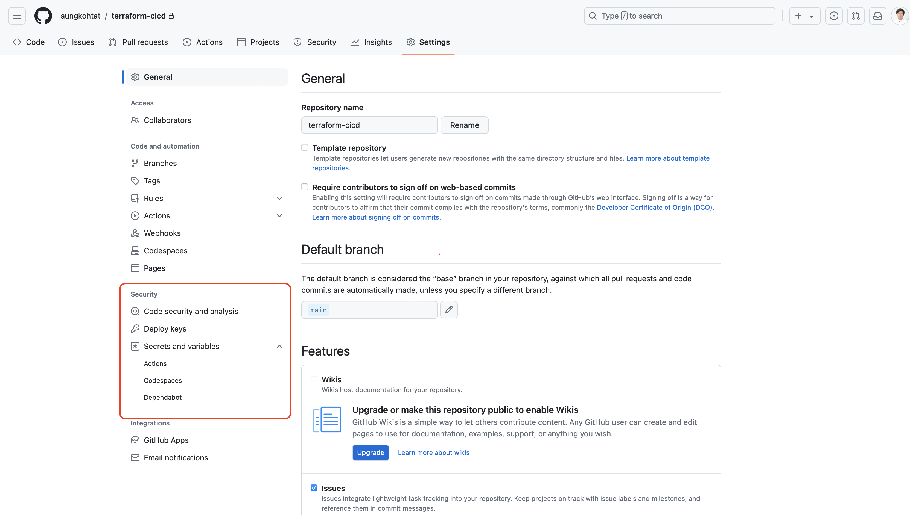
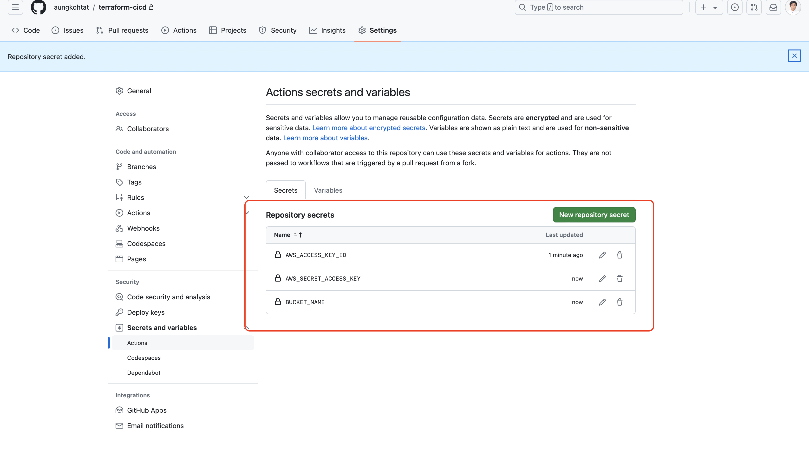

# terraform-cicd
Created EC2 instances for Development and Production environments using Terraform.
## Scenario

Created EC2 instances for Development and Production environments using Terraform.

**CI/CD Process:**

1. **Infrastructure as Code (IaC):**
    - Use two branches in the repository: one for development and one for production.
2. **Continuous Integration (CI):**
    - When source code is pushed to the development branch, automatically deploy it to the development environment.
3. **Continuous Deployment (CD):**
    - If the deployment to the development environment is successful, request manual approval.
    - Once approved, automatically deploy to the production environment.
4. **Terraform State Management:**
    - Store the Terraform state files in S3, organized into separate folders for each environment (development and production).

### I will store terraform state file in below backet

### CICD Configuration in GitHub

### CICD Workflows Step by Step

